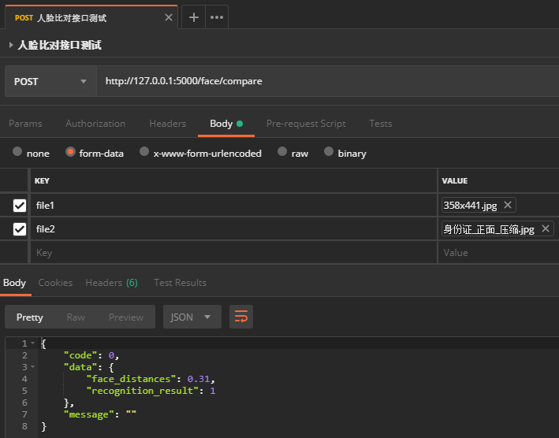

# face-recognition-service

[](https://gitee.com/westinyang/face-recognition-service)
[](https://gitee.com/westinyang/face-recognition-service/blob/master/LICENSE)
[](https://gitee.com/westinyang/face-recognition-service/pulls)
[]()
#### 介绍

使用 `Face Recognition` & `Flask` 构建的人脸比对服务，提供HTTP接口，Pyinstaller打包项目为可独立运行的exe程序。

新增人脸比对差值，可参考接口返回结果中的 `face_distances` 自行判定是否比对通过。

本地没环境？打包太麻烦？此处直接下载最新发行版 [face-recognition-service v1.1](https://gitee.com/westinyang/face-recognition-service/releases/v1.1)

#### 配置文件说明 `config.ini`：

``` ini
[config]
; 服务端口号，默认5000
port=5000
; 阈值，太低容易造成无法成功识别人脸，太高容易造成人脸识别混淆，默认0.6，推荐0.39、0.49
; 也可以理解为两张人脸的差值（不相似度），比对结果 < 此值，人脸比对通过
tolerance=0.49
; 允许上传文件的扩展名，默认png,jpg,jpeg
allowed_extension=png,jpg,jpeg
```

#### 运行效果




#### 开发环境

> 安装所需文件打包下载地址：[face_recognition_win10_install_requires.zip](https://pan.baidu.com/s/1vneStX-WuObn4VHqUlbvDg)

- Windows 10 64 Bit
- Python 3.6
- numpy-1.15.0+mkl-cp36-cp36m-win_amd64
- scipy-1.1.0-cp36-cp36m-win_amd64
- boost_1_68_0-msvc-14.0-64
- dlib-19.15
- cmake-3.12.1-win64-x64

#### 安装要求

> 新版本dlib 不再需要 Boost了，所以你可以跳过它。请记住，您仍需要满足以下要求
1. 安装了C / C ++编译器的Microsoft Visual Studio 2015（或更高版本）
2. `Python3`（我使用的是 `Python 3.6 x64`，其他版本应该也可以）
3. `Boost` 库版本1.63或更新的版本
4. `CMake` 安装并且添加到系统环境变量

#### 安装教程

> 参考教程：[Windows Installation Tutorial](https://github.com/ageitgey/face_recognition/issues/175)

1. 从此 [链接](http://www.lfd.uci.edu/~gohlke/pythonlibs/) 下载并安装 `scipy` 和 `numpy+mkl`（必须是mkl版本）软件包。请记住根据您当前的Python版本获取正确的版本
2. 从此 [链接](https://sourceforge.net/projects/boost/files/) 下载当前二进制版本的 `Boost`，并解压到C:\local\boost_1_XX_X
3. 从此 [仓库](https://github.com/davisking/dlib) 中获取最新版本的 `dlib`，并解压至任意目录
4. 转到 `dlib` 目录打开cmd并按照以下命令构建dlib：(记得用 `Boost` 的当前版本替换XX）
``` cmd
set BOOST_ROOT=C:\local\boost_X_XX_X
set BOOST_LIBRARYDIR=C:\local\boost_X_XX_X\stage\lib
python setup.py install --yes USE_AVX_INSTRUCTIONS
or
python setup.py install --yes USE_AVX_INSTRUCTIONS --yes DLIB_USE_CUDA
```
5. `pip show dlib`
6. `pip install face_recognition`
7. `pip install configparser flask flask_cors`
8. `cd 当前项目目录`
9. `python main.py` 
10. 请享用

#### 打包教程

> 参考教程：[Freeze your script with Pyinstaller](https://github.com/ageitgey/face_recognition/issues/357)

1. 确保您已经正确安装了项目相关依赖，并且脚本能正常运行
2. `pip install pyinstaller`
3. 从 `Python安装目录/Lib/site-packages` 中复制 `face_recognition_models` 和 `scipy-extra-dll` 到当前项目根目录，如果没有 `scipy-extra-dll`，在当前项目根目录创建一个同名的空文件夹
4. 修改 `main.spec` 第13行 `pathex` 的值为当前项目在你电脑的绝对路径
5. 运行 `build.bat` （打包过程会比较慢，耐心等待...）
6. 如果没有看到错误信息，则可以在 `dist` 目录中找到您的可执行文件 main.exe
7. 请享用

#### 参与贡献

1. Fork 本仓库
2. 新建 Feat_xxx 分支
3. 提交代码
4. 新建 Pull Request